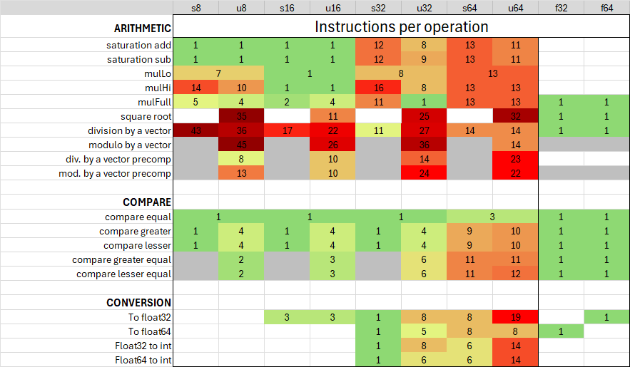

# SSE2 Complete
SIMD on x86 has this bizarre and apparently arbitrary lack of many fundamental operations, particularly regarding integers, making it difficult to work with. Later extensions (like SSE4.1 and especially AVX-512) have gone a long way in improving this. Unfortunately, unlike SSE2 they aren’t available on all x86-64 CPUs requiring projects that utilize them to sacrifice compatibility with older machines or maintain both a SIMD and scalar fallback implementation then dynamic dispatch between them.

This header only library aims to provide fast and efficient software implements of these missing operations only using SIMD instructions that are supported on all 64-bit x86 CPUs. This means that project can safely use this library without increasing their minimum hardware requirements well still benefiting from a wealth of SIMD accelerated operations. It may also be useful as a more performant fallback implementation than scalar instructions.

# Supported operations

This library provides full support for the following operations via the [Intel Intrinsics](https://www.intel.com/content/www/us/en/docs/intrinsics-guide/index.html) `__m128` types:

<picture>
  
</picture>

...and more! See the [documentation](../../wiki/Function-documentation) or the [instruction matrix](external/Instruction_matrix_FULL.png) for a full list of all added operations.

# Quick Start
This is a header only library so all you need to do is place the [sseComplete.h file](include/sseComplete.h) and [sseCom_parts folder](include/sseCom_parts) in your project and then use a `#include "sseComplete.h"` directive in your source file. You can also choose to only include a single header file in the sseCom_parts folder, which will automatically include any additional internal dependencies as well.

Each public function in this library will have the following signature:

`_<str:operation name>_<char:type><int:bit width>x<int:elements>[str:Lo|Hi]`

Examples:
- `_div_u32x4`: Divide unsigned 32-bit integers
- `_mulFull_i8x16Hi`: Full multiplication (16-bit product) of the upper signed 8-bit integers
- `_convert_f32x4_u32x4`: Convert 32-bit floats into unsigned 32-bit integers

[See the function documentation for all signatures](../../wiki/Function-documentation)

### Compiler support
This library should work on all major compilers (clang, GCC, MSVC, ICC). However, because I occasionally needed some platform specific hardware features for the best performance, a handful of operations may not be available on all compilers. In particular, the 64-bit `mulHi` only works on compiler that support the `__int128_t` extension type or MSVC’s intrinsics. Unsupported functions are automatically removed by the preprocessor and shouldn’t cause any issues.

### Unit and performance testing
Additionally, this repository [includes unit tests and microbenchmark testing](tests) source files. The microbenchmarks compare multiple different implementations of the same operation which I used to determine which version to use in this library. Our [releases](../../releases) contain compiled versions for both Windows and Linux which you can run yourself.

# Credits
"*Faster Remainder by Direct Computation: Applications to Compilers and Software Libraries*" Daniel Lemire, Owen Kaser, Nathan Kurz [arXiv:1902.01961](https://arxiv.org/abs/1902.01961)
